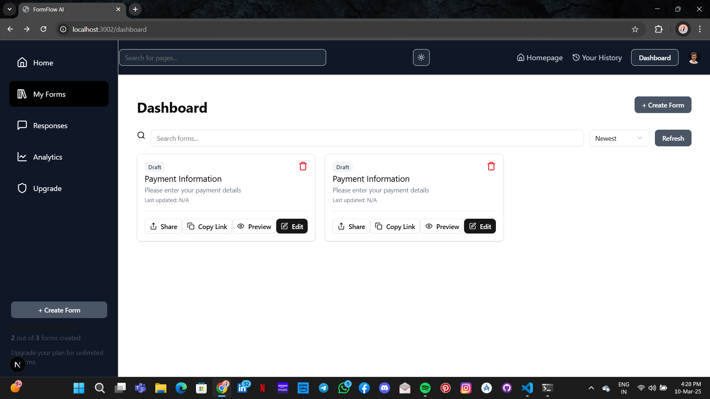

<h1 align="center">🚀 FormFlow AI - Intelligent Form Management</h1>

  <strong>AI-powered Form Builder & Management System</strong> 
  Built using <b>Next.js, Clerk, Drizzle, and Gemini AI.</b>

## 🎥 Live Demo

### 📺 Video Demo
[]
> Click the image above to watch the demo.

### 🖼️ Screenshot

<h2>🚀 Getting Started</h2>

Follow these steps to set up and run the project locally:

<h3>1️⃣ Clone the Repository</h3>
<pre><code>git clone https://github.com/your-username/formflow-ai.git
cd formflow-ai</code></pre>

<h3>2️⃣ Install Dependencies</h3>
<pre><code>npm install
# or
yarn install
# or
pnpm install
</code></pre>

<h3>3️⃣ Set Up Environment Variables</h3>

Create a <code>.env.local</code> file in the root directory and add:

<pre><code>NEXT_PUBLIC_CLERK_PUBLISHABLE_KEY=your-clerk-publishable-key
CLERK_SECRET_KEY=your-clerk-secret-key
NEXT_PUBLIC_CLERK_SIGN_IN_URL=/sign-in
NEXT_PUBLIC_CLERK_SIGN_UP_URL=/sign-up
NEXT_PUBLIC_GEMINI_API_KEY=your-gemini-api-key
NEXT_PUBLIC_DATABASE_URL_CONFIG=your-database-url
</code></pre>

<h3>4️⃣ Run Development Server</h3>
<pre><code>npm run dev
# or
yarn dev
# or
pnpm dev
</code></pre>

Open <a href="http://localhost:3000" target="_blank">http://localhost:3000</a> in your browser to see the platform in action.

<h2>🛠️ Tech Stack</h2>

<ul>
<li><strong>Framework:</strong> Next.js (App Router)</li>
<li><strong>Authentication:</strong> Clerk</li>
<li><strong>Database:</strong> Drizzle ORM</li>
<li><strong>AI Integration:</strong> Gemini API (Google)</li>
<li><strong>Deployment:</strong> Vercel</li>
<li><strong>Styling:</strong> Tailwind CSS + shadcn/ui</li>
</ul>

<h2>💡 Key Features</h2>

<ul>
<li>🚀 AI-powered Form Generation & Validation</li>
<li>🔐 Secure Authentication with Clerk</li>
<li>⚡ Smart Form Suggestions via Gemini AI</li>
<li>📊 Data Management using Drizzle ORM</li>
<li>🎨 Beautiful UI with Tailwind CSS & shadcn/ui</li>
<li>📱 Fully Responsive & Accessible</li>
</ul>

<h2>📚 Learn More</h2>

<ul>
<li><a href="https://nextjs.org/docs" target="_blank">Next.js Documentation</a></li>
<li><a href="https://clerk.dev/docs" target="_blank">Clerk Documentation</a></li>
<li><a href="https://orm.drizzle.team/" target="_blank">Drizzle ORM Documentation</a></li>
<li><a href="https://ai.google.dev/" target="_blank">Gemini API Documentation</a></li>
</ul>

<h2>🚀 Deploying on Vercel</h2>

The recommended way to deploy FormFlow AI is using <a href="https://vercel.com/" target="_blank">Vercel</a>.

<pre><code>npx vercel</code></pre>

<h2>📧 Contributing</h2>

We welcome contributions! Please fork the repository, make changes, and submit a pull request.

<h2>📄 License</h2>

This project is licensed under the <a href="https://opensource.org/licenses/MIT">MIT License</a>.

⭐️ Made with ❤️ by the FormFlow AI Team ⭐️

